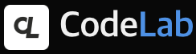
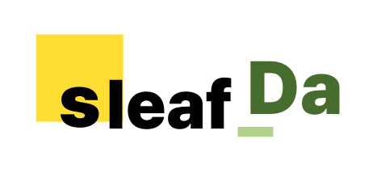

  <!-- 세련된 그라데이션 웨이브 배너 -->
  

 

<!-- 두 팀의 로고를 수평 정렬로 깔끔하게 배치 (태그 오류 수정 완료) -->

  

    

 

## About Me

> **"웹을 도화지 삼아 다양한 물리 시뮬레이션 엔진과 독창적인 실험적 예제들을 구현해 나갑니다."**

안녕하세요! 저는 웹 개발을 핵심 기반으로 삼아, 시각적인 물리 시뮬레이션과 참신하고 독특한 아이디어를 동작하는 소프트웨어로 설계하고 구현하는 것을 좋아하는 개발자입니다. 

*   **인터랙티브 물리 시뮬레이션**: 2D/3D 환경 내 젤리 물리 시뮬레이션 및 다차원 물리 엔진을 웹 환경 상에 부드럽게 재현해 내는 데 흥미가 있습니다.
*   **실험적 아이디어 실현**: WebAssembly 기반의 독자적인 경량 컴파일 언어 설계 등 정형화된 틀을 벗어난 도전적이고 재밌는 예제 프로젝트들을 꾸준히 제작해 나가고 있습니다.

---

## 🛠 Tech Stack

  
  
  
  
  
  
  
  
  

*   **Web Technologies**: HTML5, CSS3, JavaScript (ES6+), TypeScript
*   **System & Application Development**: C (Low-level optimization), C# (.NET framework), Python (Automation & Scripting), Go (High-concurrency servers)

---

## 📊 Git Statistics

  
  

  Crafted with precision by <strong>imsohappisy</strong>.

